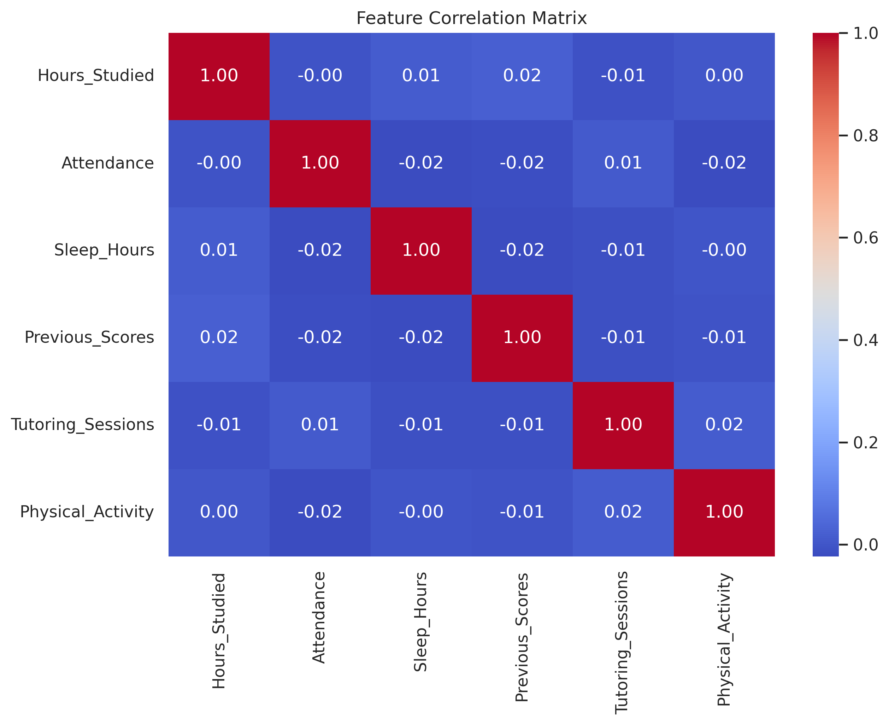
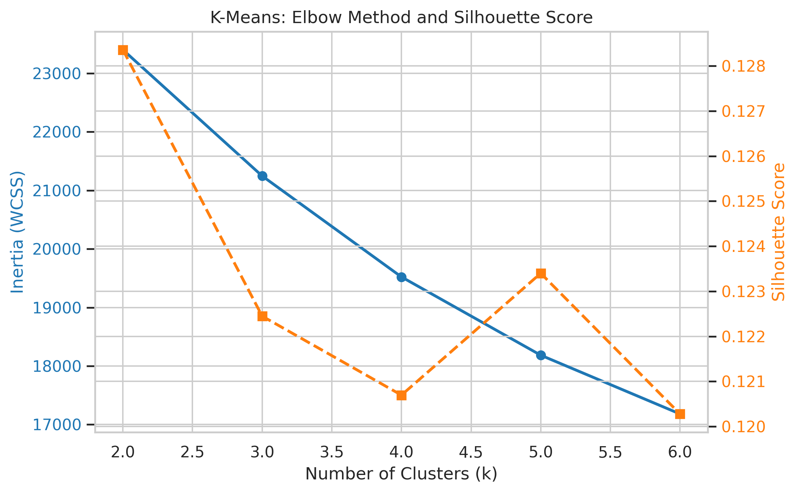
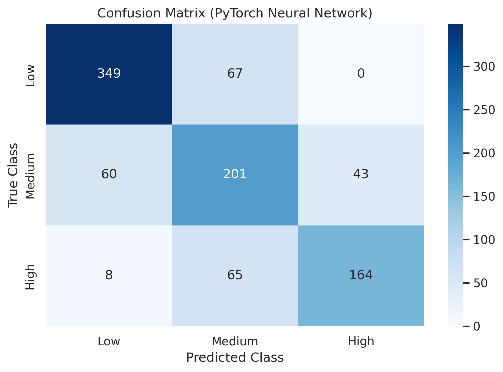

# 🎓 Student Performance Analysis: K-Means Clustering vs. Deep Neural Network (PyTorch)

---

## 1. Project Description & Problem Statement

### Research Question
> **"How well do natural student clusters based on study habits align with academic performance groups, and how accurately can a supervised Neural Network predict these groups?"**

* **Real-world Problem:** Early identification of struggling students (low performance group) to provide timely academic support.
* **Input Data:** Numerical and categorical student study habits and performance records (study hours, attendance, past scores, etc.).
* **Output / Target:** Academic performance category (`0: Low`, `1: Medium`, `2: High`).
* **Practical Value:** Understanding the main drivers of student success and building an automated early warning system.

---

## 2. Dataset & Features

* **Data Source:** Kaggle *Student Performance Factors* dataset (~6,600 clean rows after using `dropna()`).
* **Features included in the model ($X$):**
  * Numerical: `Hours_Studied`, `Attendance`, `Sleep_Hours`, `Previous_Scores`, `Tutoring_Sessions`, `Physical_Activity`.
  * Categorical: `Parental_Education`, `Access_to_Resources`, `Motivation_Level`, `School_Type`.
* **Features EXCLUDED from $X$:**
  * `Exam_Score` — excluded to prevent **Data Leakage**, as the target variable $y$ is created directly from it.
  * 

### Data Issues
1. **Different Feature Scales:** Attendance ranges from 60 to 100%, while tutoring sessions range from 0 to 5. Feature scaling is required.
2. **Class Imbalance:** Simple threshold cuts put most students into the `Medium` class. We solved this using quantile splitting.

*(Insert your correlation matrix image here)*
**Key Correlation Insight:** `Attendance` and `Hours_Studied` have the strongest positive correlation with exam scores. Sleep hours and physical activity show non-linear relationships.

---

## 3. Data Preprocessing Pipeline and Formulas

The data processing pipeline prevents any data leakage across subsets:

## 3. Data Preprocessing Pipeline and Formulas

The data processing pipeline prevents any data leakage across subsets:

**Pipeline Flow:** Raw Data ➔ dropna() ➔ Target Quantile Split (qcut) ➔ Stratified 70/15/15 Split ➔ Scaling and OHE

### Preprocessing Formulas:

1. **Balanced Target Split (3-way Quantiles):**
   Splitting final scores into 3 equal groups (33.3% of data each) using quantiles ($q = 3$):
   * $Q_1 = \text{Percentile}_{33.33}(Y)$
   * $Q_2 = \text{Percentile}_{66.67}(Y)$
   
   Class Assignment:
   * **Low (0):** $Y \le Q_1$
   * **Medium (1):** $Q_1 < Y \le Q_2$
   * **High (2):** $Y > Q_2$

2. **StandardScaler (Z-score Normalization):**
   Fitted strictly on $X_{\text{train}}$ and applied to Validation and Test sets:
   
   $$z = \frac{x - \mu_{\text{train}}}{\sigma_{\text{train}}}$$

3. **One-Hot Encoding (OHE):**
   Converting a categorical feature $C$ with $K$ values into $K$ binary columns:
   
   $$x_{i,k} = \begin{cases} 1 & \text{if } C_i = k \\ 0 & \text{otherwise} \end{cases}$$

---

## 4. Model Descriptions and Parameters

### 1. K-Means Clustering (Unsupervised)
Groups data points by minimizing the distance between points and their cluster centers (centroids).

* **Inertia Formula (WCSS):**
  
  $$\text{Inertia} = \sum_{j=1}^{k} \sum_{x_i \in C_j} ||x_i - \mu_j||^2$$

* **Silhouette Score Formula:**
  
  $$s(i) = \frac{b(i) - a(i)}{\max(a(i), b(i))}$$

### 2. Deep Neural Network (PyTorch MLP)
A Multi-Layer Perceptron designed for 3-class classification.

* **Architecture:** Input ($N_{\text{features}}$) ➔ Hidden Layer 1 (ReLU + Dropout 0.2) ➔ Hidden Layer 2 (ReLU + Dropout 0.2) ➔ Output (3 Logits)
* **Parameters:** Learning Rate $\alpha = 0.001$ (Adam), Epochs = 80, Batch Size = 32
* **Loss Function (Cross-Entropy Loss):**
  
  $$\mathcal{L} = -\sum_{c=1}^{3} y_c \log(\hat{y}_c)$$

---

## 5. Experimental Design

Data is divided into **Train (70%)**, **Validation (15%)**, and **Test (15%)** sets using stratified sampling (`stratify=y`). Model selection is based on the **Validation Macro F1-Score**.

### Neural Network Architecture Comparison:

| Architecture | Hidden Layers | Dropout | Val Accuracy | Val Macro F1 | Selection |
| :--- | :---: | :---: | :---: | :---: | :---: |
| **Arch 1** | `6 → 8 → 3` | 0.2 | INSERT_% | INSERT_F1 | ❌ |
| **Arch 2** | `6 → 16 → 8 → 3` | 0.2 | INSERT_% | INSERT_F1 | ❌ |
| **Arch 3** | `6 → 32 → 16 → 3` | 0.2 | **INSERT_%** | **INSERT_F1** | **✅ Selected** |

---

## 6. Results and Visualizations

### Final Test Set Performance:

| Model | Accuracy | Macro F1-Score | Recall (Low Class) | Quality Metric |
| :--- | :---: | :---: | :---: | :---: |
| **K-Means ($k=3$)** | — | — | — | ARI = **0.1451** / Silhouette = **0.1224** |
| **PyTorch NN (Arch 3)** | **INSERT_%** | **INSERT_F1** | **INSERT_%** | Test Loss = **INSERT_LOSS** |

---

### Key Plots and Comments:

* #### 1. Choosing k for K-Means (Elbow Method and Silhouette Score)

* **Comment:** The elbow plot bend and the highest silhouette peak at $k=3$ confirm that 3 clusters is the optimal choice.

#### 3. Confusion Matrix (3x3)

* **Comment:** The model clearly separates the extreme `Low` and `High` classes. Minor errors only occur along boundaries of neighboring classes.
---

## 7. Conclusion and Answer to Research Question

**Answer to Research Question:** 
**K-Means clustering** identified natural lifestyle patterns, but showed a low alignment with actual final grade tiers ($\text{ARI} = 0.1451$). This shows that natural student study habits do not map directly to strict grade categories without guidance.

In contrast, the **supervised PyTorch Neural Network** successfully captured non-linear relationships and accurately predicted student performance groups without overfitting.

---

## 8. Limitations and Future Research

### Limitations:
1. **Missing Psychological Factors:** The dataset lacks measures of student stress levels, mental health, and exam anxiety.
2. **Limited Model Families:** Only K-Means and an MLP neural network were tested. Tree-based models (such as CatBoost or XGBoost) were not evaluated.
3. **Strict Quantile Boundaries:** A fixed 33.3% cut means a student with score 65 might fall into `Low` while score 66 falls into `Medium`.

### Future Research:
* Test gradient boosting models (CatBoost, XGBoost) to compare against neural networks on tabular data.
* Apply model interpretability tools (**SHAP values**) to measure the exact contribution of each feature for individual students.
